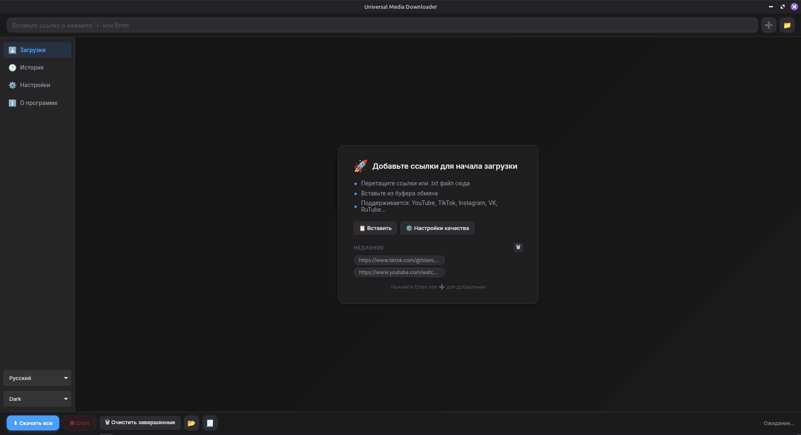
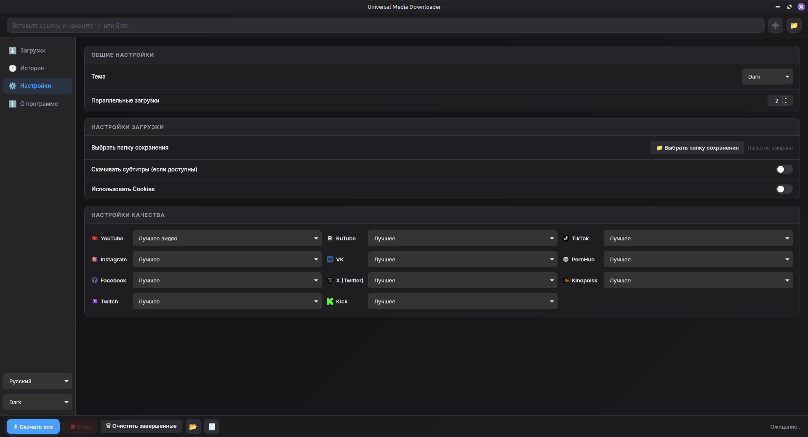

# Universal Media Downloader

*Read in other languages: [Русский](README.ru.md)*




A modern, fast, and feature-rich media downloader built with Tauri v2, Vue 3, and Rust.

## From Python to Tauri + Rust

Historically, this application was built using Python and PyQt6. While functional, it had limitations in UI polish, performance overhead, and distribution size. 

**Why Tauri?**
1. **Performance**: Rust backend executes operations incredibly fast with very small memory footprint compared to the old Python daemon.
2. **Native UX & Aesthetics**: Moving to Vue 3 (frontend) allowed for a completely custom, beautiful, and fluid interface with custom CSS variables, theming (Dark/Light), Glassmorphism, and hardware-accelerated animations that were hard to achieve in PyQt6.
3. **Cross-Platform Delivery**: Tauri compiles down to a single compact native executable for Windows, macOS, and Linux without requiring users to install huge Python environments.

### Key Improvements in v1.1
- ✨ **Enhanced UI/UX**: Completely redesigned dark/light theme, modern shadows, smooth CSS transitions, and micro-animations.
- ⚡ **Optimized Download Queue**: Rust-powered asynchronous download manager allows robust parallel downloading.
- 🍪 **Cookie Extraction**: Built-in support to extract cookies locally directly from your browser.
- 🔄 **Live Tracking**: True reactive progress bars tracking `.mp4` packaging and `FFmpeg` processing in real-time.

## Features

- **Multi-Platform Support**: Downloads videos and audio from YouTube, TikTok, Instagram, VK, RuTube, Twitch, Kick, X (Twitter), Facebook, and many others (powered by `yt-dlp`).
- **Parallel Downloading**: Download multiple files simultaneously instead of one-by-one.
- **Auto-Merge**: Uses FFmpeg to automatically package best-quality isolated video and audio streams.
- **Custom Quality**: Fine-grained logic to pick 4K, 1080p, or Audio-Only modes.
- **History Tracking**: Keeps a persistent database of downloaded files with quick-actions to re-download.

## Installation and Setup

### Prerequisites

To run or build this project, you will need the following tools installed on your system:
- [Node.js](https://nodejs.org/) (v16 or higher)
- [Rust](https://www.rust-lang.org/tools/install)
- [FFmpeg](https://ffmpeg.org/download.html) (Placed in system path or `assets/ffmpeg/bin`)
- [yt-dlp](https://github.com/yt-dlp/yt-dlp) (or it can be installed via the app)
- [Deno](https://deno.com/) (required for executing complex extractors in `yt-dlp`)

### Development

Start the development server with live-reloading:

```bash
cd tauri-app
npm install
npm run tauri dev
```

### Building for Production

To create a standalone native executable for your current operating system, run:

```bash
cd tauri-app
npm run tauri build
```

Once the build is complete, you will find the installer/executable in `tauri-app/src-tauri/target/release/bundle/`.
